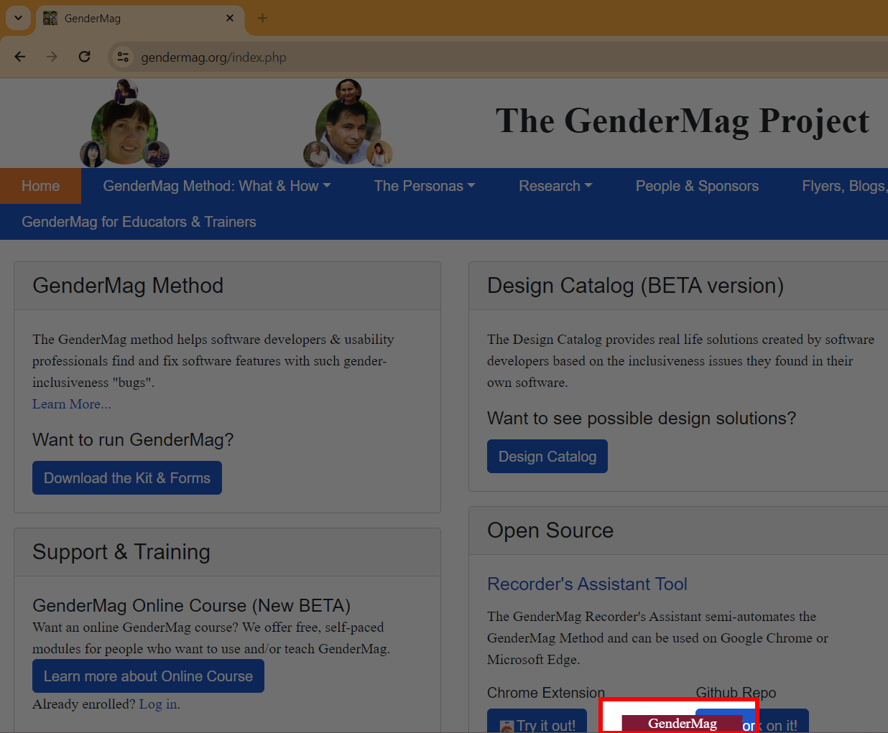
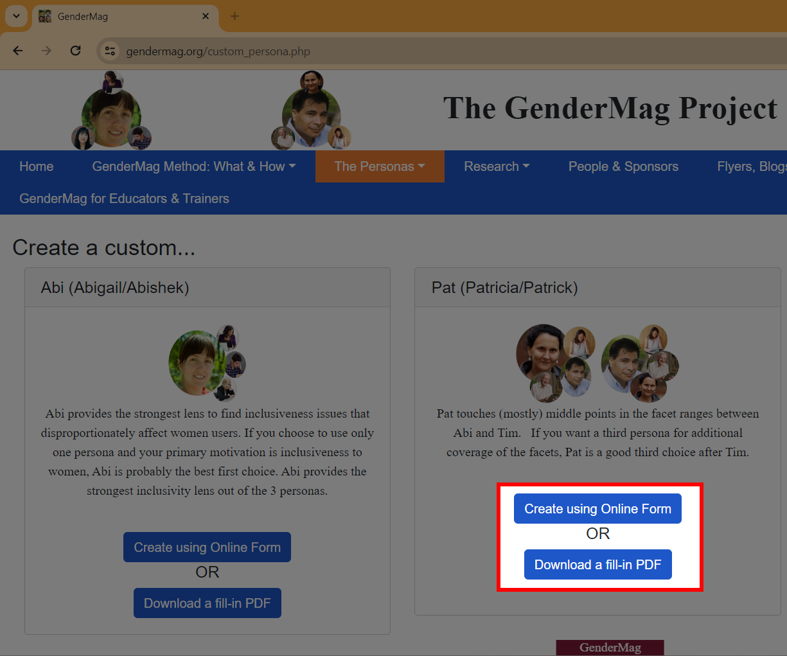
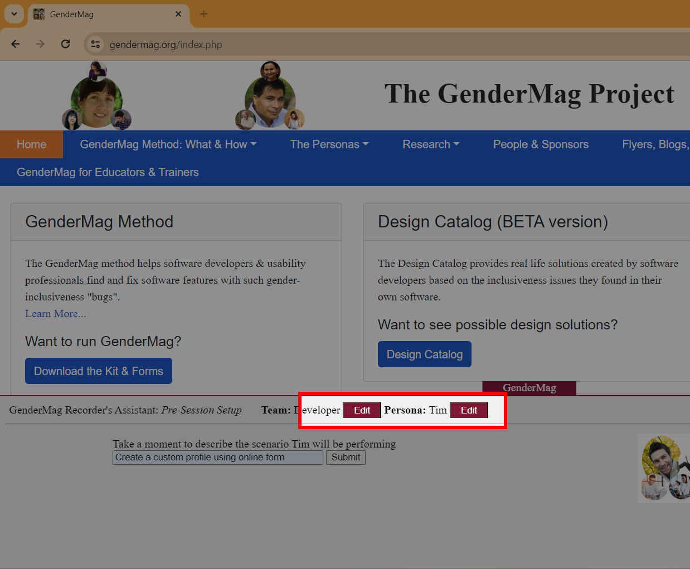

# What is the GenderMag Recorder's Assistant?

The GenderMag Recorder’s Assistant is a Chrome Extension tool that you can use 
from Google Chrome or Microsoft Edge to identify gender-inclusiveness 
issues in software. [GenderMag](http://gendermag.org/) is a process you can use 
to find gender biases in user-facing software that you are designing/building. 
The GenderMag Recorder’s Assistant semi-automates using this process. It is easy
to use and can be used by software engineers to management to usability experts.

If you want to help make software gender-inclusive, one way is to contribute to 
the GenderMag Recorder’s Assistant. We welcome everyone with any background to 
contribute to making the world of software more gender inclusive. There are many 
different ways to contribute, please see this section on <a href="#Contributing">
Contributing</a>.  

<a name="install">
    
## Resources and Background Information

* Chrome Extension link: [GenderMag Recorder's Assistant](https://chrome.google.com/webstore/detail/gendermag-recorders-assis/efacfbjnfhfaplaglplaljdleimiiflf?hl=en)
* [Download Chrome](https://www.google.com/chrome/)
* Short paper: [The GenderMag Recorder’s Assistant](https://ieeexplore.ieee.org/document/8506505) 
* Long paper (Research Study): [Semi-Automating (or not) a Socio-Technical Method for Socio-Technical Systems](https://ieeexplore.ieee.org/document/8506514)
* [Video](https://www.youtube.com/watch?v=GOy7Aq5lozQ) using the GenderMag Recorder's Assistant.
    
# How does GenderMag make software more inclusive?</h1>

Gender Mag Recorders Assistant walks people through how to analyze their website based on different personas. These personas are created by considering 5 cognitive style facets. Each of these facets is a spectrum, and every person can have tendencies to fall in a certain part of the spectrum based on their specific personality and the use case.

The five facets are...

GenderMag uses 3 different personalities to help analyze software that fall onto different parts of each spectrum.

While each individual can be at different points on these spectrums, facets statistically cluster around genders; for example, Abi's facet values are those frequently seen in women. As a result, analyzing different personas can be a way to help understand how a range of diverse users can use a program differently and have different needs and wants when using a program. Considering this whole range can thus lead to more gender-inclusive (and overall inclusive) software.

GenderMag Recorders Assistant is a semi-automated tool that helps users walk through their software in the mindset of each of the personas and consider how they would each use the software. As a result, creators can find areas where their software only caters to part of the spectrum on each of the five cognitive style facets and address these issues to make the software more inclusive.

<h1>Examples of How to Cater to People with a Range of Cognitive Facets</h1>

<h4>Example 1 - Motivations:</h4> Explaining the pros and cons of using different features can help users regardless of where they fall on the spectrum of motivations. Users who are solely interested in completing a task can quickly discern the relevant features to use and users with a tech interest can quickly determine which features interest them.

<h4>Example 2 - Attitude Toward Risk:</h4> A message pop up asking the user if they are sure they wish to delete a file before doing so to make sure they do not accidentally lose data can prevent risk takers from accidentally deleting files. A guide explaining what happens when a user switches to the new version of a software could help a risk-averse person decide if they wish to make the change.

<h4>Example 3 - Learning Style:</h4> Guides showing how to complete relevant tasks on the website such as a set of written instructions, an FAQs page, or a video walkthrough can help people who are process-oriented learners. In order to also appeal to tinkerers, these guides can be optional. For example, there could be a popup the first time a user logins asking if they would like to go through the guides or proceed straight to the homepage.

# How to install the GenderMag Recorder's Assistant:</a>

## Method 1: Download from GitHub: 

1) On the Recorder's Assistant GitHub page, click on "Clone or 
download" and then click "Download zip".

2) Extract the downloaded zip file.
    
4) Open Chrome and click on the icon (⋮) in the top right corner.
    

5) Click on “Extensions” -> “Manage Extensions”.
    
6) If Developer Mode is not enabled, click on the slider in the upper right.
    
7) Click on “Load unpacked” under the search bar in the top left.
    
8) Select the extracted *zip file* and click "ok". 
  * Don't select the standard file folder (only the zip file will upload).
  * (For Windows) 
    * Right click on the extracted folder and then click open, or double click on the extracted folder to go one level deeper, then click Select Folder.
    * If the top level is selected you will get "Manifest file is missing".
    * Ex. GenderMagRecordersAssistant -> GenderMagRecordersAssistant (select this one).

9) Click on “Update” under the search bar in the top left.
    
10) The new extension called ”GenderMag Recorder's Assistant” should be in the 
top left corner of the extensions.

## Method 2: Install from Chrome Web Store
 
  
  For more details about extension installation [click here](https://support.google.com/chrome_webstore/answer/2664769?hl=en)

Note that if you are using Microsoft Edge, you must select "Allow extensions 
from other stores" in the banner at the top of the Chrome Store page, then 
select "Allow" to confirm  before you select "Add to Chrome".

# How to Run a GenderMag Session Using the Tool
A GenderMag session is simply an instance of using the GenderMag method. If 
you have downloaded and installed the tool and want to run it, make sure the 
extension is enabled, navigate to the page you wish to perform GenderMag on 
and click the GenderMag button at the bottom of the screen. 

See the [video](http://gendermag.org/genderMag.html) from GenderMag.org for examples 
and/or read the guide below.

Here is a step-by-step guide on how to run the Recorder Assistant tool: 

   1) After you have installed the GenderMag recorder's assistance extension a 
   maroon button will appear on the bottom middle of the screen. Click it to 
   open the tool.

      
      
   2) After clicking on the maroon button, text explaining what GenderMag is 
   will appear on the screen. Click on "Start GenderMag" to get started.

   3) Enter the name of your team and click submit.
   
   4) Select the persona that you want to use for this session. 
      Currently, you can select from these personas: Abi, Tim, Pat, or a custom persona of your creation.

      After you have selected the persona, the description of the selected 
      persona you selected will appear to the right.
      
      If you selected a custom persona, navigate to http://gendermag.org/custom_persona.php and design your custom persona using an online or PDF form. Your custom persona's facets and characteristics will be listed on these forms instead of in the GenderMag extension.

      

      If you want to change the persona or team name, click edit on top of the tool.

      
   
   5) Provide the scenario that your persona will be performing in the text box and click submit.
    
   6) Enter a subgoal and click 'enter subgoal'. 
   
   7) Answer Yes, No, or Maybe to describe if the persona would have formed this
    subgoal as a step to their overall goal. In the text box, explain 
    why, why not, or why maybe. On the right of that text box, select all the 
    checkboxes corresponding to the facets that were used to answer the previous
    question. Then click save and continue.
    
   8) Enter an action that pertains to this subgoal. 
   
   9) Click on the 'click here' button to take a screen capture of ideal action.
   
      Move the rectangular box around your box to the action that you want to focus 
      on and hit the left click. This will create a screen capture of ideal action. 

      

      If you want to add more info to the capture click on the draw on the image 
      button and annotate the image. If the image looks okay, click 'save and 
      continue'.

   10) Answer: Yes, No, or Maybe for, will the persona know what to do at this 
   step, and in the text box under it explain why, why not, or why maybe? On 
   the right of that textbox select all the checkboxes against the facets that 
   were used to answer the previous question.

   11) Perform the action you indicated previously in step 9 and click on the 
   'click here' link to continue.
   
   12) Answer: Yes, No, or Maybe for, if the persona did the right thing will 
   she know that they did the right thing, and is making progress towards the 
   goal and in the textbox under it explain why, why not, or why maybe? On the 
   right of that textbox select all the checkboxes against the facets that were
   used to answer the previous question. Click 'save and continue' when ready.
       
   13) If your persona needs another action to complete the current subgoal, 
   enter the new action in the top text box and click 'add another action'. 
   Return to (9) and complete all subsequent steps.
   
   14) If the subgoal is complete, but another subgoal is needed to complete 
   the scenario, enter the subgoal in the bottom text box and click 'create new 
   subgoal'. Return to (7) and complete all subsequent steps. 
    
   15) If the scenario has been completed, click 'download and end my GenderMag 
   session'. This will take you to another page and download a zip file with 
   your session's information.
   
   16) If the zip file was not downloaded click Re-Download zip file. Otherwise,
   check the box next to the disclaimer saying that the file was downloaded and
   hit "Quit GenderMag". This will reload the page and close the tool.

See the video at http://gendermag.org for examples of what running the tool 
looks like.

## How to Disable GenderMag:

To turn off the GenderMag extension navigate back to “Extensions” and uncheck 
the “Enable” box and uncheck “Developer Mode”.

# Contributing

Please review and follow our 
[Code Of Conduct](https://github.com/mendezc1/GenderMagRecordersAssistant/blob/master/Code_of_Conduct.md).

There are many different ways you can contribute, and we are appreciative of your efforts. If you are a first time contributor and a little hesitant, please take a little time to look through some of the options available. You can contribute to this tool by:  

* Providing a review while testing use of the tool
  * Actual use of the tool with examples of how you used it. Reviews for the Chrome extension can be made on the [Chrome Web Store site](https://chrome.google.com/webstore/detail/gendermag-recorders-assis/efacfbjnfhfaplaglplaljdleimiiflf)

* Writing code / fixing issues
  * The [Contributing Guide](https://github.com/mendezc1/GenderMagRecordersAssistant/blob/master/Contributing.MD) is dedicated to people who wish to write code
* Reviewing / writing documentation
  * Documentation is key to a good user experience, this project is no different. Any documentation on this site is open to review and improvement. There may already be open issues regarding documentation, please take a look at the [Github Issues List](https://github.com/GenderMagProject/GenderMagRecordersAssistant/issues)
* Making foreign language translations
  * Please enquire by creating a [Github issue](https://github.com/GenderMagProject/GenderMagRecordersAssistant/issues) or by sending email to [gendermag.method@gmail.com](mailto:gendermag.method@gmail.com)
* Making improvements to this Github Repository
  * Maintenance of this project site and its documents is important to help people find what they need. Sometimes it is as simple as correcting spelling or verifying any links are still valid and fixing broken ones. Follow the [Github instructions for making a new fork](https://docs.github.com/en/get-started/quickstart/fork-a-repo) and then submit changes via a pull request. Don't forget to submit info via the [pull request template](https://github.com/GenderMagProject/GenderMagRecordersAssistant/blob/master/PULL_REQUEST_TEMPLATE.md). 

# FAQ’s:
Note: If you have questions you would like us to answer, please let us know by filing an issue asking the question!

1. How to install  GenderMag Recorder’s Assistant (chrome extension):
  
  <a href="#install">Instructions here</a>
    
2. Technologies used in the project:
    
    HTML, CSS, and JavaScript
     
3. Why should GenderMag be used?

     Gender biases within software indirectly discourage people of marginalized genders from engaging with technology. Software that isn't inclusive for all genders loses out on an enormous market of paying consumers and potential technological contributors. By addressing these gender biases, GenderMag helps improve software experiences for end-users of any genders. Visit http://gendermag.org/index.php for more information.
    
4. When should GenderMag be used?

    GenderMag should be used during the process of designing user interfaces. It can also be used to evaluate the inclusivity of existing software. 

5. Who should use the GenderMag Tool?

    The GenderMag tool's primary audience is software practitioners and usability professionals (e.g., developers, managers, UX professionals).

6. What is the output file created by the GenderMag Tool?

    The output file has two forms. The 'old' format is optimized for graphing or using a computer to parse the information from your GenderMag session. The 'new' format is optimized for reading the results of the GM session. Both types are CSV files and contain all the answers submitted during the use of the tool.

7. What do you mean by subgoal, scenario, action, and other terms used throughout GenderMag?

    Scenario/Use Case: the hypothetical situation you are walking through and evaluating (e.g., Abi wants to find a science fiction book)
    
    
    Subgoal: what the developer or designer hopes the user is thinking of doing next (e.g., see bookstore map)
    
    
    Action: what the persona needs to do to meet a subgoal (e.g., click on "browse off")
    Visit http://gendermag.org/gendermag.php for more information.

8. How can I contribute to this project?

    Please see the contributing guidelines [here](https://github.com/GenderMagProject/GenderMagRecordersAssistant/blob/master/Contributing.MD).
    
    
9. As a newcomer to the project, what problem should I start with?

    If you navigate and click on the Issues tab, at the top of the screen, and filter by the "Good First Issue" any issue you see there would be a good place to start.
    
10. I have an unanswered question or need to contact someone about the project.

    Please open an issue, and we will get back to you ASAP.
    
# Attributions
This guide was written using Handbook of Software Engineering Methods by Lara Letaw which was written under the Creative Commons Attribution-NonCommercial License (CC BY-NC). The images showing the five facets and the 3 personas are taken directly from the textbook. The textbook can be accessed here: https://github.com/setextbook/setextbook.
